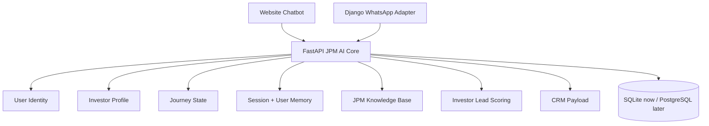
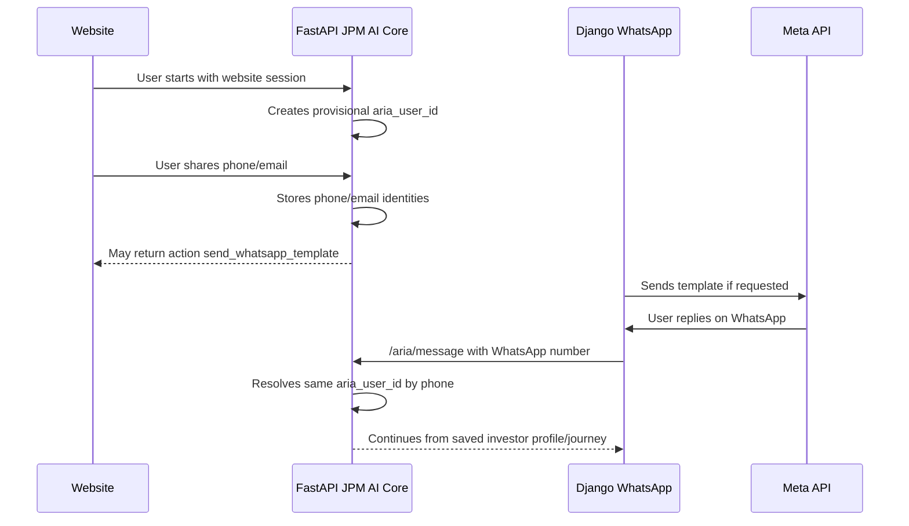

# JPM Property Flipping AI Core

FastAPI is the intelligence layer for the JPM Property Flipping assistant across website chat and WhatsApp. It owns AI response generation, session memory, cross-channel identity, investor qualification, lead scoring, knowledge retrieval, and CRM payload generation.

Django WhatsApp remains the transport and operations layer. It receives Meta webhooks, stores WhatsApp messages, manages templates/campaigns/inbox, and sends replies returned by FastAPI.

## Current Persona

The assistant is a professional real estate investment consultant for JPM Property Flipping.

Tone rules:
- Professional, calm, transparent, and helpful.
- Never salesy or pushy.
- Never guarantees profits.
- Never gives legal or tax advice.
- Never invents ROI, minimum investment, current project details, timelines, or legal structures.
- Escalates to a human investment advisor for current projects, documentation, legal/tax questions, registration, callback requests, meetings, and complex financial questions.

## Business Model

JPM Property Flipping is a real estate investment platform syndicate. Investors participate in specific professionally managed property flipping projects instead of purchasing an entire property individually.

JPM identifies a property, purchases it, renovates it, sells it, and distributes project profits to participating investors according to project-specific terms and documentation.

## Architecture



## Ownership

FastAPI owns:
- JPM investment assistant persona and response generation.
- Investor qualification and objection handling.
- Shared user identity across website and WhatsApp.
- Investor profile memory.
- Journey state and next question tracking.
- Lead scoring, lead summary, and next action.
- CRM payload generation.
- Local JPM knowledge retrieval.

Django owns:
- Meta WhatsApp webhooks.
- WhatsApp contact and message records.
- Meta Cloud API delivery.
- Templates, campaigns, inbox, notifications, and agent operations.

## Important Files

```text
app/main.py                 FastAPI app, /chat, /aria/message, knowledge endpoints
app/aria_core.py            Identity, profile, memory, journey orchestration
app/chatbot.py              JPM answer generation, LLM planner, deterministic fallback
app/conversation.py         Investor state machine, extraction, scoring helpers
app/lead_analyzer.py        Investor lead type, urgency, summary, next action
app/crm_payload.py          CRM payload generation with investor fields
app/retrieval.py            Local JPM knowledge retrieval
app/storage.py              SQLite sessions/messages storage
app/schemas.py              API request/response schemas
data/build/academy_knowledge.txt  Active local knowledge file, kept at legacy path
data/docs/JPM Property Flipping Knowledge Base.md  Source JPM knowledge document
tests/                      Investor policy and CRM payload tests
```

Some public/internal field names such as `course_title`, `course_category`, and `preferred_course` remain for backward compatibility with the existing API, storage, and CRM contracts. In the JPM flow, those fields represent project/investment interest where needed.

## Investor Qualification

The assistant captures investor details only when relevant and avoids repeated questions.

Useful fields:
- Full name.
- Phone or WhatsApp number.
- Email, optional but useful for brochures/documents.
- Approximate investment amount.
- Preferred callback time.
- Investment timeline.
- Short-term or long-term return preference.
- Investment experience.
- Personal, joint, or company investment mode.
- City/state location.
- Whether the visitor wants an investment advisor.

High-intent examples:
- "I want to invest."
- "How do I start?"
- "What projects are available?"
- "I have 25 lakhs."
- "Can someone call me?"
- "Where do I register?"

High-intent action:
Collect name, phone, email, investment amount, and preferred callback time, then hand off to a JPM investment advisor.

## Lead Scoring

Lead scoring is deterministic and auditable in `app/conversation.py` and `app/lead_analyzer.py`.

Signals include:
- Contact details.
- Investment interest.
- Investment amount.
- Timeline.
- Advisor request.
- Current project or documentation request.
- Preferred callback time.

Lead types:
- `Hot`: strong investment/callback/project intent plus meaningful qualification data.
- `Warm`: engaged investor with partial qualification.
- `Cold`: early exploration or low qualification.
- `Dead`: spam/test-like input.

## Knowledge Base

Active retrieval reads:

```text
data/build/academy_knowledge.txt
```

The filename is legacy, but its content is now JPM-specific. The source Markdown is:

```text
data/docs/JPM Property Flipping Knowledge Base.md
```

The ingestion command filters legacy course documents when `ACADEMY_NAME` contains `JPM`, so a rebuild does not pull old academy/course content back into the active knowledge file.

## Main API Endpoints

### `GET /health`

Service health.

### `POST /chat`

Legacy website chatbot endpoint. Kept for existing website clients.

Example:

```json
{
  "message": "I want to invest 25 lakhs this month. Can someone call me?",
  "session_id": null
}
```

Response includes `answer`, `lead_type`, `lead_score`, `needs_callback`, `lead_data`, `summary`, and `quick_replies`.

### `POST /aria/message`

Unified endpoint for website and WhatsApp channel adapters.

Website request:

```json
{
  "channel": "website",
  "channel_session_id": "web-123",
  "message": "Hi, I want to understand JPM property flipping",
  "identity": {},
  "metadata": {"source_url": "https://example.com"}
}
```

WhatsApp request:

```json
{
  "channel": "whatsapp",
  "channel_session_id": "919876543210",
  "message": "I have 25 lakhs and want current project details",
  "identity": {"whatsapp_number": "+919876543210"},
  "metadata": {"contact_id": 42, "provider_message_id": "wamid.xxx"}
}
```

Response includes `aria_user_id`, `session_id`, `answer`, `profile`, `journey_state`, `lead`, `actions`, and `memory_summary`.

### `POST /chat/end`

Ends the chat session and builds/pushes the CRM payload.

### `POST /knowledge/rebuild`

Rebuilds the local knowledge file from source docs and optional website crawl.

## Journey State

Journey state tracks investor progress.

Current investor flows in `app/aria_core.py`:
- `investor_minimal_v1`: name, phone, email, investment amount, callback time.
- `investor_deep_profile_v1`: contact details plus investor profile, amount, timeline, return preference, experience, mode, location, and callback time.

Example:

```json
{
  "current_stage": "INVESTOR_PROFILE_IN_PROGRESS",
  "current_category": "Property Flipping Investment",
  "flow_id": "investor_deep_profile_v1",
  "last_completed_question": "investment_amount",
  "next_question": "investment_timeline",
  "progress_percentage": 45,
  "is_complete": false
}
```

## Cross-Channel Continuity



Identity merge rules:
- WhatsApp number match -> same user.
- Phone number match -> same user.
- Email match -> same user for current implementation.
- Website session only -> provisional user.
- Name-only match -> never merge.

## Run Locally

```bash
cd "/Users/miracneroid/Developer/Office/Projects/Clients/JPM_Chatbot/Web/chatbot"
python -m venv .venv
source .venv/bin/activate
pip install -r requirements.txt
python -m uvicorn app.main:app --reload --port 8001
```

## Verification

```bash
cd "/Users/miracneroid/Developer/Office/Projects/Clients/JPM_Chatbot/Web/chatbot"
python -m pytest tests
python -m compileall app
```

Verified after JPM conversion:

```text
7 passed
```

Smoke test:

```bash
python - <<'PY'
from fastapi.testclient import TestClient
from app.main import app

client = TestClient(app)
resp = client.post('/chat', json={
    'message': 'I want to invest 25 lakhs this month. Can someone call me?'
})
data = resp.json()
assert data['lead_type'] == 'Hot'
assert data['needs_callback'] is True
assert data['lead_data']['investment_amount'] == '25 lakhs'
assert data['lead_data']['investment_timeline'] == 'This month'
print(data['answer'])
PY
```

## LLM Configuration

```env
APP_NAME=JPM Property Flipping Chatbot API
ACADEMY_NAME=JPM Property Flipping
AI_PROVIDER=multi
GROQ_API_KEY=...
GROQ_MODEL=llama-3.3-70b-versatile
OPENROUTER_API_KEY=...
OPENROUTER_MODELS=...
OPENAI_API_KEY=...
OPENAI_MODEL=gpt-5-mini
```

If no provider is configured or all providers fail, the assistant uses deterministic guarded fallback responses.

## Operational Rules

- `/chat` remains for existing website clients.
- `/aria/message` is the shared API for website and WhatsApp.
- Django should not run a second AI brain for JPM conversations.
- The old native Gemini responder in Django is not called by the active WhatsApp webhook path.
- Do not reintroduce course/admissions wording into prompts, fallback answers, or knowledge docs.
- Do not quote ROI, minimum investment, project duration, legal structure, or tax outcomes unless verified project-specific data is provided by the business.
- SQLite is fine for development; PostgreSQL is recommended before production.
